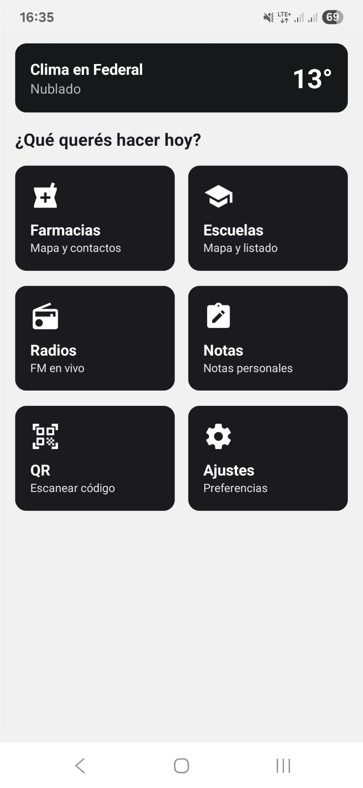
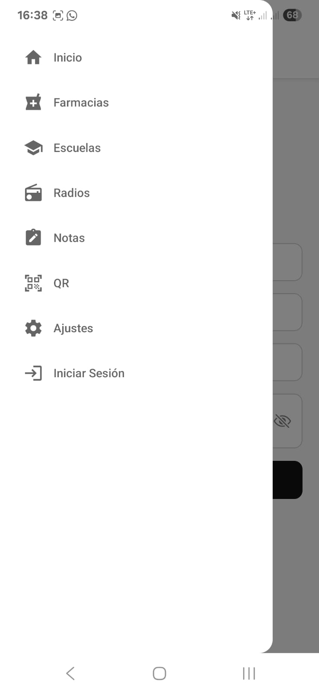
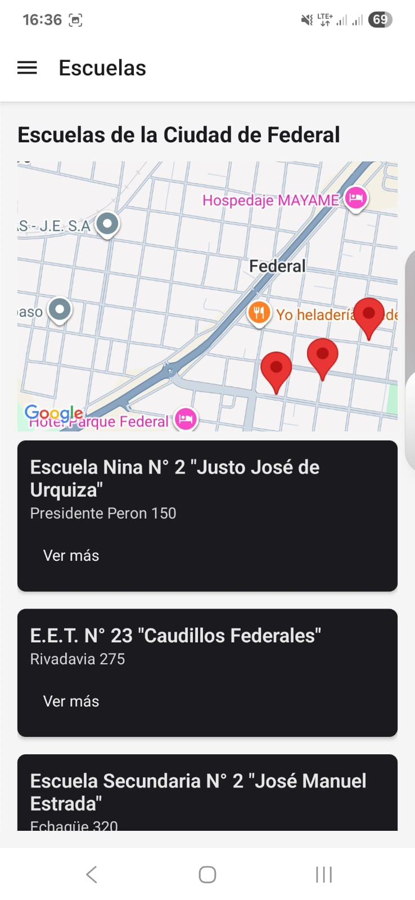
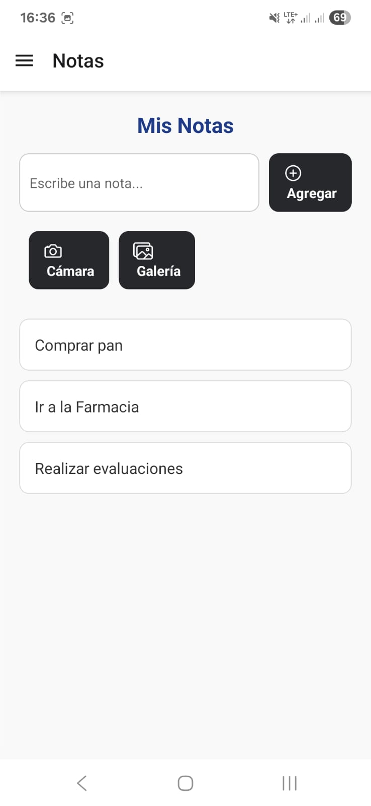

# 📱 Mi Ciudad

**Mi Ciudad** es una aplicación móvil desarrollada con **React Native + Expo** como proyecto para la materia  
**Desarrollo de Aplicaciones Móviles – Tecnicatura Universitaria en Desarrollo Web (UNER)**.

Está pensada para los habitantes de **Federal (Entre Ríos, Argentina)** y ofrece acceso rápido a información local (farmacias, escuelas, teléfonos útiles, radios), además de herramientas personales como notas con recordatorios y lector de códigos QR.

---

## 👥 Integrantes

- **Demichelis, Agustín**
- **Gimenez Silva, Enzo Daniel**
---

## 🔗 Repositorio

👉 https://github.com/demichelisgimenez/Mi_Ciudad.git

---

## 🧩 Descripción general de la app

- Información actualizada de **farmacias** y **escuelas** de la ciudad, con mapa, filtros y datos de contacto.
- Sección de **radios locales** con reproducción en vivo y **reproductor flotante** que acompaña al usuario en toda la app.
- Módulo de **notas personales** con posibilidad de agregar imágenes y programar **recordatorios con notificaciones locales**.
- **Teléfonos útiles** organizados por categoría para llamar con un solo toque.
- **Lector QR** que permite escanear códigos, abrir enlaces o guardar el QR como nota.
- Sistema de **autenticación de usuarios** con registro, inicio de sesión, recuperación y cambio de contraseña.
- Pantalla de **ajustes** para gestionar preferencias y la cuenta del usuario.

---

## 🚀 Tecnologías utilizadas

### Frontend / Mobile

- [React Native](https://reactnative.dev/) `0.81.4`
- [Expo](https://expo.dev/) `54.0.12`
- [TypeScript](https://www.typescriptlang.org/) `^5.9.2`

### Navegación

- `@react-navigation/native`
- `@react-navigation/drawer`
- `@react-navigation/native-stack`
- `@react-navigation/bottom-tabs`

### Backend / Servicios

- `@supabase/supabase-js` — autenticación y persistencia remota de datos.
- **OpenWeather API** — información de clima en Federal.

### Funcionalidades nativas

- `expo-location` — ubicación (para clima/contexto).
- `expo-camera` y `expo-image-picker` — fotos y selección de imágenes.
- `expo-notifications` — notificaciones locales.
- `expo-audio` — reproducción de audio para radios.
- `expo-secure-store` — almacenamiento seguro de datos sensibles.
- `react-native-maps` — mapas de escuelas y farmacias.
- `@react-native-async-storage/async-storage` — persistencia local.

### Otras librerías

- `formik` y `yup` — formularios y validaciones.
- `@shopify/flash-list` — listas performantes.
- `react-hook-form` — algunas pantallas de formularios.

---

## 📚 Pantallas y funcionalidades

### 🏠 Inicio

Pantalla principal de la app. Muestra:

- **Módulo de clima** en Federal (temperatura, estado, icono).
- Pregunta “¿Qué querés hacer hoy?” con acceso rápido a:
  - Farmacias
  - Escuelas
  - Radios
  - Notas
  - QR
  - Ajustes
- Botón destacado de **Teléfonos útiles**.

🖼️ 
---

### 📞 Teléfonos útiles

Listado de teléfonos organizados por categorías:

- Emergencias (policía, bomberos, ambulancia).
- Salud (hospital, centros médicos).
- Seguridad.
- Municipio y servicios.
- Otros servicios relevantes.

Cada fila permite **llamar directamente** con un toque.

🖼️ 

---

### 📂 Menú lateral (Drawer)

Menú de navegación con acceso a todas las secciones:

- Inicio
- Farmacias
- Escuelas
- Radios
- Notas
- QR
- Ajustes

Al final del menú se muestra la opción **“Iniciar sesión / Registrarme”** si el usuario no está autenticado, y el crédito con el copyright del proyecto.

🖼️ 

---

### 🔐 Registro e inicio de sesión

Flujo de autenticación con Supabase:

- **Registro**: formulario con nombre, apellido, email y contraseña.
- **Inicio de sesión**: email + contraseña.
- Enlace para usuarios que ya tienen cuenta.
- Integración con recuperación de contraseña vía correo.

🖼️ 
🖼️       
🖼️ 
🖼️ 
🖼️ 
🖼️ 
🖼️ 
---

### 🏫 Escuelas

Módulo para consultar escuelas de Federal:

- Mapa con marcadores de cada institución.
- Filtros por nivel: **Todos, Inicial, Primaria, Secundaria, Adultos**, etc.
- Buscador por nombre, dirección o CUE.
- Vista con datos de cada escuela:
  - Dirección
  - Contacto telefónico
  - CUE
  - Opciones: **Llamar**, **Cómo llegar**, **Volver**.

🖼️ 
🖼️ 
🖼️ 
🖼️ 
🖼️ 
🖼️ 
🖼️ 
🖼️ 
---

### 💊 Farmacias

Sección dedicada a farmacias de la ciudad:

- Listado con:
  - Nombre
  - Dirección
  - Teléfono
  - Horarios de atención
  - Estado actual (**Abierto ahora** / Cerrado)
- Filtro por:
  - **Todas**
  - **Abierto ahora**
- Botones rápidos:
  - **Llamar**
  - **Cómo llegar**
  - **Volver**
- Vista de mapa con marcadores de todas las farmacias.

🖼️  
🖼️  
🖼️  
🖼️  

---

### 📝 Mis Notas

Herramienta para guardar recordatorios personales:

- Si el usuario **no inició sesión**, se muestran botones de:
  - **Iniciar sesión**
  - **Registrarme**
- Si está autenticado:
  - Crear notas con:
    - Título (opcional)
    - Descripción/contenido
  - Agregar imágenes desde:
    - **Cámara**
    - **Galería**
  - Listado de notas creadas con opciones:
    - **Editar**
    - **Eliminar**

🖼️  
🖼️ 
🖼️  
🖼️  
🖼️  

#### ⏰ Recordatorios y notificaciones

- Desde cada nota se puede agregar un **recordatorio**.
- Asistente paso a paso:
  1. Seleccionar fecha.
  2. Elegir hora de inicio.
  3. Elegir hora de fin.
- Se usan componentes de **DateTimePicker** para la hora.
- La app programa una **notificación local** que se dispara en el rango definido.
- Es posible **editar** o **eliminar** el recordatorio.
- Cuando llega la notificación, se muestra en el dispositivo y se destaca la nota correspondiente.

🖼️  
🖼️  
🖼️  
🖼️ 
🖼️  
---

### 📻 Radios + Reproductor flotante

Módulo de radios FM locales:

- Listado de emisoras con nombre y descripción.
- Botón para reproducir en vivo.
🖼️  

#### 🎧 Reproductor flotante

- Al reproducir una radio, aparece un **mini reproductor** en la parte inferior.
- El reproductor:
  - Muestra el nombre de la emisora.
  - Permite **play/pausa**.
  - Puede moverse a lo largo de la pantalla.
  - Se mantiene visible mientras el usuario navega por **cualquier pantalla de la app**.
- Mejora la experiencia al permitir escuchar radio mientras se consultan farmacias, notas, etc.

🖼️ 
🖼️  
🖼️  

---

### 📷 Lector QR

Herramienta para trabajar con códigos QR:

- Escaneo de QR desde la cámara. Extrae el link y lo sipone para ser abierto en el navegador.
- Posibilidad de **guardar el contenido del QR como nota**.
- Mensajes de confirmación al guardar.
- Opción de **cargar una imagen con un QR** desde la galería para leerlo.

🖼️ 
🖼️ 
🖼️ 
🖼️ 
---

### ⚙️ Ajustes

Pantalla de configuración de la app:

- Información de la cuenta actual (si está logueado).
- Opción para **cerrar sesión**.
- Botón para **cambiar contraseña**, que inicia el flujo de actualización a través de Supabase.
- Gestión de permisos y preferencias básicas.

🖼️ `./assets/screenshots/ajustes.png`  
🖼️ `./assets/screenshots/ajustes-cambiar-contraseña.png`

---

## 🌟 Funcionalidades extra destacadas

Además de la información básica de la ciudad, la app incorpora varias funcionalidades que enriquecen la experiencia del usuario:

- 📻 **Reproductor flotante de radio**  
  Permite seguir escuchando la radio mientras se navega por otras pantallas.

- 🔔 **Recordatorios con notificaciones locales en Notas**  
  El usuario puede programar avisos en días y horarios específicos.

- 📸 **Notas con imágenes**  
  Adjuntar fotos desde la cámara o galería para complementar la información.

- 📷 **Guardado de QR como nota**  
  Tras escanear un QR, es posible guardarlo directamente en Mis Notas.

- 🔐 **Cambio de contraseña desde Ajustes**  
  Gestión completa de la cuenta sin salir de la app.

---

## 🛠️ Instalación y ejecución

### Requisitos

- Node.js instalado.
- Expo Go en el dispositivo móvil (o emulador Android/iOS configurado).

### Pasos

```bash
# 1. Clonar el repositorio
git clone https://github.com/demichelisgimenez/Mi_Ciudad.git
cd Mi_Ciudad

# 2. Instalar dependencias
npm install

# 3. Ejecutar en modo desarrollo
npm start
# o
npx expo start
